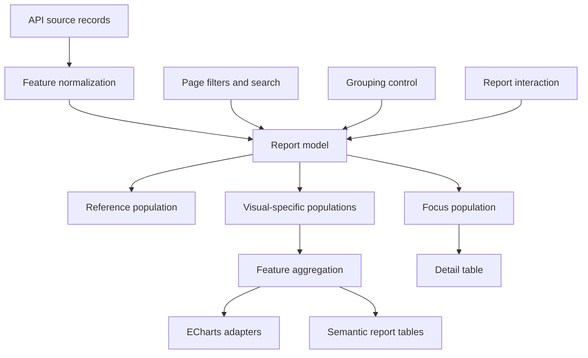

# Frontend reporting architecture

## Status

Current shared frontend architecture, implemented for the ODCR Coverage Report.
Further report adoption remains incremental. Feature specifications remain
authoritative for domain calculations, visible content, and feature-specific
interactions.

The initial consumer is the [ODCR Coverage Report](../specs/odcr-coverage-report.md). The
technology choice is recorded in
[ADR 0001: Interactive reporting stack](../decisions/0001-interactive-reporting-stack.md).

## Goals

- Give report features one consistent model for reference data, selections,
  focused data, and derived visual values.
- Standardize Apache ECharts lifecycle, events, accessibility, and visual
  updates.
- Keep domain calculations independent from chart and table rendering.
- Coordinate charts, semantic report tables, and detail tables without direct
  visual-to-visual dependencies.
- Preserve the existing Alpine.js and classic-script application architecture.
- Make report behavior testable without a browser or ECharts instance.

## Non-goals

- Replacing Alpine.js or introducing a frontend build system.
- Providing a generic user-authored dashboard or pivot-table designer.
- Moving backend aggregation or filtering into the browser when an API contract
  assigns it to the backend.
- Defining feature-specific categories, calculations, labels, layouts, or
  acceptance criteria.
- Standardizing every existing data table on a third-party grid library.

## Ownership boundaries

The shared reporting layer owns:

- Reference and focus population semantics.
- Report facet and selection-state mechanics.
- Deterministic recomputation and notification of report state.
- Common chart lifecycle and visual selection behavior.
- Renderer-neutral view models for charts and report tables.
- Shared formatting, loading, empty, error, and accessibility conventions.

Each feature owns:

- How source records become report records.
- Domain classifications and derived measures.
- Available dimensions and facets.
- Which visual interactions change which facets.
- Layout, labels, category order, colors with domain meaning, and tooltips.
- Effects on feature-specific detail tables and checked-row state.

Renderers own presentation only. An ECharts instance, semantic table, or detail
table must not independently calculate domain status or become the source of
truth for report selections.

## Module design

The shared implementation consists of two modules with narrow responsibilities.
Names below describe contracts; exact filenames may follow the existing
`web/js/shared` conventions.

### Report model

The report model is a framework-independent JavaScript module. It owns the
current report inputs and exposes immutable snapshots or equivalent read-only
views to Alpine and renderers.

Its state contains these concepts:

| State | Meaning |
| --- | --- |
| Source records | The complete records loaded for the feature |
| Reference population | Source records matching page filters and search |
| Grouping | The active report grouping dimension |
| Facet selections | Selected values for each feature-defined report facet |
| Focus population | Reference records matching all report facet selections |
| Visual populations | Reference records matching all facets, except the active editing context in its originating visual |
| Derived views | Renderer-neutral aggregates calculated from the applicable visual population |
| Revision | A monotonic change identifier used to coordinate rendering |

Feature adapters provide pure functions for record normalization, facet
matching, grouping, and visual aggregation. Shared code must not contain
ODCR-specific categories or rules.

The model supports these operations:

- Replace source records.
- Replace the page-filter and search predicate or its resulting population.
- Change grouping.
- Replace, add, or remove facet selections.
- Clear all report selections.
- Read active selections, reference records, focus records, visual populations,
  and derived views.
- Subscribe to one coherent state-change notification.

Selection values use stable data keys rather than display labels. Missing or
unknown values are normalized by the feature adapter before entering a facet.
Multiple values within a facet are ORed; different facets are ANDed. An empty
facet does not constrain the focus population.

### ECharts adapter

The ECharts adapter standardizes mechanics shared by report charts:

- Initialize with the vendored ECharts asset and the canvas renderer.
- Update an existing instance with a complete option derived from the latest
  report snapshot.
- Register feature-provided semantic selection handlers.
- Map model selection state to persistent selected visual states.
- Resize through `ResizeObserver`, with the established deferred window-resize
  fallback where required.
- Dispose observers, handlers, and the ECharts instance when its owning view is
  removed or replaced.
- Render loading, empty, and error states without synthetic data points.
- Expose an accessible textual summary and keyboard-operable legend or
  equivalent controls outside a canvas.

The adapter accepts data and callbacks; it does not own report facets. Legend
interaction must be explicitly mapped to the same semantic action as the
corresponding chart item. ECharts' default legend visibility toggle is disabled
when the feature specification defines legend selection as report filtering.

## Data flow

Alpine owns controls and feature orchestration. It sends semantic actions to the
model and reacts to model revisions. Renderers receive derived state from the
model; they do not call each other.

## Reference and focus populations

The reference population is established by source data, page-level filters,
and search. It is the stable input from which every filtered population is
projected.

The focus population is the subset of the reference population matching active
report facets. Detail tables consume it when the feature specifies full
cross-filtering.

The latest filtering interaction establishes one active editing context: its
originating visual and the facet, or compound facets, changed by that
interaction. Only that visual excludes those active facets from its visual
population, preserving the alternatives needed to extend or replace the
current selection. Every other visual applies every active facet and therefore
narrows immediately. When another facet is edited, its visual becomes the new
active context and the previous visual applies the complete selection set. The
feature adapter tracks this context; the generic report model applies the
exclusion set requested by that adapter.

Feature specifications may define an adjustment gesture that changes an older
facet without moving the active editing context. They may also define a restart
gesture that clears the selection sequence and establishes a new context.

Report selection or active-context changes recompute focus state and affected visual populations.
Source data, page-filter, search, or grouping changes may recompute reference
and all projected populations. This one-way flow prevents circular recomputation
and visual feedback loops.

A visual must not derive its next population from another visual's rendered or
aggregated output. Every population is projected directly from reference records
and the current facet-selection snapshot.

## Interaction contract

Renderer events are translated into semantic actions containing:

- The originating visual identifier.
- The facet identifier.
- One or more stable selected values.
- The operation: replace, add, remove, toggle, or clear.
- Optional feature-defined context for compound selections.

The model applies the action once and emits one resulting revision. Every
renderer then updates from that same revision. Renderers must not dispatch new
selection actions while applying model state.

Shared dimension selections or compound cell selections are feature-level
compositions of ordinary facet operations. They should be applied as one model
transaction so consumers never render an intermediate state.

Any side effect caused by a report selection, such as resetting detail-table
pagination or clearing checked rows, is invoked by the feature controller after
the model accepts the transaction. It is not embedded in the generic model.

Features may expose active facet types in a single clear-filter control. Such a
summary is derived from semantic facet identifiers, uses feature-facing labels,
and clears the report selection atomically; it does not expose or infer state
from rendered chart or table labels.

## Rendering conventions

### Charts

- ECharts is the standard chart engine for interactive report charts.
- A chart option is derived from a report snapshot, not incrementally mutated
  from prior rendered output.
- Category identity is carried in data keys, not recovered from labels.
- Colors remain stable while categories are reordered or selected.
- The visual population determines chart geometry and denominators. Selection
  state remains visible through persistent controls or chart emphasis.
- A zero-total chart displays a feature-defined empty state and no synthetic
  slice or bar.
- Tooltips and accessible summaries use the same unrounded source measures.

### Report tables and matrices

Semantic HTML is the default for compact report tables and matrices whose row,
column, total, population, and selection semantics are part of the feature. Shared
CSS and behavior provide sticky regions, sorting indicators, focus treatment,
selection treatment, numeric alignment, and tooltips.

A grid library is appropriate only when data volume or general table mechanics
justify the dependency and a prototype confirms that keyboard and semantic
requirements remain intact. A grid must still consume the report model; it does
not replace it.

### Detail tables

Detail tables consume the focus population when the feature specifies
cross-filtering. Existing table sorting remains independent from report
aggregation. A report-selection change normally returns the detail table to its
first page while retaining sort state; feature specifications define checked-row
and filter-reset effects.

## Lifecycle and scheduling

- Construct one report model per mounted report feature.
- Register renderer event handlers once per renderer instance.
- Batch a semantic interaction into one model transaction and one Alpine update.
- Schedule ECharts rendering through Alpine's `$nextTick` so hidden or newly
  mounted containers have layout dimensions. Do not rely solely on
  `requestAnimationFrame`, which may be suspended in background tabs.
- Reuse chart instances across ordinary data and selection changes.
- Disconnect observers and dispose chart instances when charts are replaced,
  hidden permanently, or the feature is torn down.
- Ignore stale asynchronous results by associating them with their source-data
  request or model revision.

## Loading, empty, and error states

The shared layer distinguishes:

- Loading: the required input is not yet available.
- Empty: the applicable population contains no records.
- Error: data retrieval or visual derivation failed.
- Zero: data is available and the measured value is numerically zero.

Tiles reserve stable dimensions while loading. A failure in one derived visual
must not invalidate unrelated visuals when their inputs remain usable. Feature
specifications provide user-facing messages and decide whether empty state is
based on the reference, focus, or a visual-specific population.

All report and tabular skeletons follow the shared convention in
`frontend-loading-states.md`; feature-specific loading animations are not
introduced.

## Accessibility

- Canvas content always has an adjacent textual summary available to assistive
  technology.
- Every pointer selection has a keyboard-operable HTML control, normally a
  legend or equivalent list.
- Selection controls expose `aria-pressed` or the appropriate grid selection
  state and retain a visible focus indicator.
- Persistent selection, transient focus, hover, and warning states are visually
  distinguishable without relying on color alone.
- Tooltips open from pointer hover and keyboard focus and close on pointer exit,
  blur, or Escape as defined by the feature.
- Status changes that are not otherwise apparent are announced through the
  feature's existing accessible status mechanism.

## Testing strategy

### Model tests

Test the report model without Alpine, the DOM, or ECharts:

- OR behavior within facets and AND behavior across facets.
- Reference and focus population boundaries.
- Visual-population projection with active-context exclusion in only the
  originating visual.
- Atomic compound selections and clearing.
- Grouping and source-data replacement.
- Stable keys, zero values, and missing values.
- No mutation of source records.
- One notification per completed transaction.

Feature tests own all domain calculations and expected derived view models.

### Adapter tests

Test ECharts option builders as pure functions where practical. Verify instance
creation, event translation, resize, update, and disposal with a narrow adapter
test. Test semantic tables through DOM behavior and accessibility assertions.

### Browser tests

For each consuming feature, verify representative pointer and keyboard flows,
visual cross-filtering, detail-table filtering, clearing, responsive layout, empty
states, and absence of console errors. Canvas charts also require a nonblank
render check at desktop and mobile widths.

## Adoption sequence

1. Implement and test the report model against one feature's complete domain
   adapter while preserving its existing visible report.
2. Implement the ECharts adapter and migrate one existing chart to validate its
   lifecycle.
3. Connect new or changed report visuals to renderer-neutral derived views.
4. Add coordinated selections and detail-table side effects.
5. Complete accessibility, responsive, and browser-level validation.

Each step should be independently testable. A temporary feature flag may keep
an incomplete replacement unavailable to users until its visuals and
coordinated interactions are complete.

## Extension decisions

Before adding another reporting dependency, document the unmet requirement and
prototype it against the report model contract.

- Prefer ECharts for charts.
- Prefer semantic HTML for compact matrices and summary tables.
- Consider Tabulator for a conventional high-volume detail table when
  virtualization or table mechanics warrant it.
- Consider AG Grid only when its additional capabilities justify bundle size,
  integration cost, and any required commercial license.
- A generic analytics workbench such as FINOS Perspective is a separate product
  decision, not an implementation detail of this architecture.
