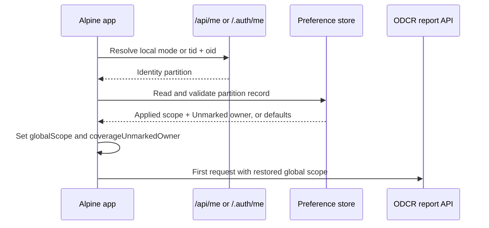

# Frontend Preference Store

## Status

Current implemented contract. Last verified on 2026-08-28.

This specification changes the current transient behavior documented in
[Global Filters](global-filters.md) and [Coverage Report](odcr-coverage-report.md).
Those documents remain the source of truth for filter semantics and report
behavior; this document owns only browser retention and restoration.

## Purpose

Retain two user preferences across navigation, full page reloads, and browser
restarts:

1. The applied Global Filter selection shared by ODCR Coverage and ODCR Usage.
2. Which ODCR Coverage block owns **Unmarked**: ODCR Required or ODCR not
   Required.

The store is a frontend concern. It does not change report request contracts,
write preferences to the backend, synchronize devices, or change VM coverage
decisions.

## Goals

- Preserve the existing behavior while the SPA remains open.
- Restore preferences after the signed-in identity has been resolved.
- Isolate preferences by tenant and user on a shared browser.
- Persist only committed Global Filters, never an open card's draft edits.
- Preserve existing Global Filter values exactly, including values that are no
  longer present in the current catalogue.
- Keep Unmarked ownership independent from the selected Global Filters.
- Fail safely when browser storage is unavailable, malformed, or from an
  unsupported schema version.

## Non-goals

- Backend, roaming, cross-device, or cross-browser synchronization.
- Live synchronization between multiple open tabs.
- Encryption or storage of credentials, tokens, user profiles, report data, or
  coverage decisions.
- A new Clear or Reset preferences action.
- Expiration, catalogue reconciliation, or unavailable-value recovery UI.
- Retaining local report filters, search, sorting, pagination, group-by,
  Coverage category selections, or unapplied Global Filter drafts.

## Storage Choice and Lifetime

Use the browser's `localStorage` API.

`localStorage` is scoped to the application's origin. It survives route changes,
page reloads, browser restarts, and ordinary sign-out. It is not shared across
origins, browsers, browser profiles, or devices. The browser may remove it when
the user clears site data or applies privacy/retention policies.

The stored data is a convenience preference, not authoritative application
state. Browser storage can be inspected or modified by the user and must not be
trusted as an authorization boundary. Subscription IDs and filter values are
not encrypted. Authentication tokens and secrets must never be stored.

When `localStorage` is blocked, unavailable, or throws because of browser
policy or quota, the application continues with in-memory defaults for the
remainder of the page session. Retention failure must not block a report.

## Identity Partition

Production preferences are partitioned by the Easy Auth tenant ID (`tid`) and
user object ID (`oid`):

```text
az-capacity.frontend-preferences.v1.<tenant-id>.<object-id>
```

The IDs remain in plain text in the key. They are identifiers rather than
secrets. The preference value must not duplicate identity claims.

Claim lookup must recognize both short claim names (`tid`, `oid`) and the claim
URI forms emitted by Microsoft identity tokens. A preference key must not be
created until both claims are available. Display name, email address,
`preferred_username`, and Easy Auth's provider-specific `user_id` are not
stable partition keys and must not be used as fallbacks.

Local development uses a dedicated key:

```text
az-capacity.frontend-preferences.v1.local
```

If the app is neither confirmed local nor able to resolve both production
identity claims, persistence is disabled for that page session. The application
must not fall back to an unpartitioned shared key.

Sign-out does not delete preferences. A subsequent sign-in by the same tenant
and object ID restores them; another identity receives a different partition.

## Stored Contract

The JSON value has this versioned shape:

```json
{
  "schemaVersion": 1,
  "globalScope": {
    "subscriptionIds": null,
    "locations": ["westeurope"],
    "contextFilters": [
      { "fieldKey": "environment", "values": ["Production", null] }
    ]
  },
  "coverageUnmarkedOwner": "not_required"
}
```

### `globalScope`

`globalScope` is the committed/applied Global Filter state. Its semantics and
request projection are unchanged from `global-filters.md`:

- `subscriptionIds`: `null` or an array of subscription ID strings.
- `locations`: `null` or an array of canonical ARM location strings.
- `contextFilters`: an array of `{ fieldKey, values }` criteria; values may
  contain JSON `null` for **Not mapped**.

The store records semantic Context criteria, not materialized subscription IDs.
Array order is preserved but has no filtering significance.

Only a successful Global Filter Save updates this property. Opening, editing,
cancelling, or dismissing the Global Filters card must not write draft state.
After restoration, `globalScopeDraft` is initialized from `globalScope` through
the existing draft-copy behavior.

### `coverageUnmarkedOwner`

Allowed values are:

- `required`: Unmarked belongs to the ODCR Required block.
- `not_required`: Unmarked belongs to the ODCR not Required block.

The default is `required`.

Ownership is a single independent preference. It is not keyed by, reset by, or
stored separately for Global Filter combinations. Moving Unmarked writes the
new owner immediately after the existing atomic report-state update. It still
changes analytical ownership only and never modifies a VM coverage decision.

### Whole-record writes

The frontend writes the complete record rather than independently updating
fields. Before each write, it reads the latest valid record for the current
identity, replaces the changed property, and writes the resulting record. This
prevents a filter save from resetting ownership, or an ownership move from
resetting filters, when one property has not yet been used in the current page.

Writes use `JSON.stringify`. No timestamps, catalogue data, identity claims, or
report data are required.

## Validation and Defaults

Browser data is untrusted. Restoration validates the parsed value before it is
assigned to Alpine state.

A valid record envelope is a plain JSON object with `schemaVersion === 1`.
After the envelope and version are accepted, properties are validated
independently:

- Invalid or missing `globalScope` becomes the unrestricted default:
  `{ subscriptionIds: null, locations: null, contextFilters: [] }`.
- Invalid or missing `coverageUnmarkedOwner` becomes `required`.

A structurally valid `globalScope` requires:

- `subscriptionIds` and `locations` to be either `null` or non-empty arrays of
  non-empty strings.
- `contextFilters` to be an array whose entries each have a unique, non-empty
  string `fieldKey` and a non-empty `values` array.
- Each Context value to be either a string or JSON `null`.
- No additional type coercion; arrays, objects, numbers, and booleans in string
  positions are invalid.

An empty `contextFilters` array is valid and means unrestricted Context. Empty
Subscription, Location, or individual Context-value arrays cannot result from
a successful UI Save and are rejected during restoration rather than creating
a persisted fail-closed selection.

Strings are not trimmed, normalized, deduplicated, or matched against the
catalogue during restoration. This deliberately matches current in-memory
behavior. Previously valid values that have since been removed or disabled are
preserved until the user saves different filters or clears browser site data.
They may produce zero rows or an existing backend filter error.

Malformed JSON, a non-object value, or an unknown `schemaVersion` causes the
entire record to be ignored. The invalid value may be removed best-effort. No
user-facing error is required; diagnostics may be written to the browser
console without including the full stored payload.

## Initialization and Data Flow

Identity resolution and preference restoration must complete before the first
ODCR report request. Settings and notification loading may continue in
parallel.



Required startup ordering:

1. Initialize in-memory defaults immediately so Alpine rendering is stable.
2. Resolve local mode or the signed-in `tid` and `oid`.
3. Derive the identity-partitioned storage key.
4. Read, parse, validate, and restore the preference record.
5. Mark preference initialization complete.
6. Load the report selected by the current route.

Report loading triggered by routing must wait on one shared initialization
promise rather than issue an unfiltered request first. The app must avoid a
second automatic reload and unfiltered-to-filtered content flash.

If identity resolution or storage access fails, step 4 yields defaults and
report loading continues. It must never wait indefinitely for preference
initialization.

## Runtime Update Rules

### Global Filters

On Global Filter Save:

1. Preserve the existing validity checks.
2. Commit `globalScopeDraft` to `globalScope`.
3. Persist the committed `globalScope` for the current identity.
4. Close the card and reload the active report using existing behavior.
5. Invalidate the inactive report using existing behavior.

A persistence exception does not roll back the in-memory commit or suppress the
report reload.

### Unmarked ownership

On **Move Unmarked here**:

1. Preserve the existing owner validation and no-op behavior.
2. Complete the existing atomic ownership and report recomputation.
3. Persist `coverageUnmarkedOwner` for the current identity.

A persistence exception does not roll back the move.

### Navigation and refresh

Route changes, Coverage/Usage tab changes, report Refresh, **Clear report
filters**, and **Reset VM filters** do not alter stored preferences. A full page
reload restores both retained properties.

There is no application-level reset action in this scope. Users can change and
Save Global Filters, move Unmarked back to ODCR Required, or clear browser site
data.

### Multiple tabs

No `storage` event listener or `BroadcastChannel` synchronization is required.
A tab keeps its current in-memory state. Changes made in another tab are picked
up only after reload. Whole-record merge-before-write reduces accidental field
loss but does not provide transactional concurrency; simultaneous writes remain
last-write-wins.

## Frontend Ownership

Introduce one small frontend preference-store module responsible for:

- Key derivation from resolved identity.
- Safe `localStorage` access.
- Parsing and structural validation.
- Defaults and schema-version handling.
- Merge-before-write updates for each retained property.

The scope feature remains the owner of Global Filter interaction and request
projection. The VM Coverage feature remains the owner of Unmarked movement and
report recomputation. The root app lifecycle owns identity-first restoration
and the gate before initial report loading.

The store must expose behavior equivalent to:

```text
read(identity) -> validated preferences or defaults
updateGlobalScope(identity, globalScope) -> best-effort void
updateCoverageUnmarkedOwner(identity, owner) -> best-effort void
```

The exact function names are an implementation detail. The module must remain
compatible with the existing no-build, classic-script frontend architecture.

## Compatibility and Migration

Version 1 has no predecessor because current preferences are memory-only. No
migration is needed.

Future incompatible shapes must use a new `schemaVersion`. Code must not guess
at unknown versions. A future migration may read the old key and write a new
versioned key; until then, an unsupported record resolves to defaults.

The backend remains authoritative for authorization, application scope, filter
validation, and report data. Restoring a subscription ID from browser storage
must never expand the signed-in user's permitted scope.

## Acceptance Criteria

1. Saving Global Filters, reloading the page, and opening either ODCR screen
   applies the saved criteria to the first report request.
2. Unapplied draft edits are discarded on reload; the last saved criteria are
   restored.
3. Moving Unmarked to ODCR not Required and reloading Coverage restores it to
   that block.
4. Unmarked ownership remains unchanged when Global Filters are saved, changed,
   or unrestricted.
5. Global Filters remain unchanged when Unmarked ownership is moved.
6. The same `tid` and `oid` recover their preferences after sign-out/sign-in;
   a different user or tenant does not.
7. Local development uses only the dedicated local partition.
8. Missing production identity claims disable persistence instead of using a
   shared fallback key.
9. Stale but structurally valid filter values are restored unchanged without a
   catalogue request or automatic removal.
10. Malformed JSON, unsupported versions, invalid properties, unavailable
    storage, and write failures do not prevent report use.
11. No token, credential, identity profile, catalogue, report row, or coverage
    decision is written to browser storage.
12. A second open tab does not change until it reloads.

## Verification Plan

### Automated tests

- Key derivation for production, local development, and missing claims.
- Reading defaults when no record exists.
- Round-trip serialization for unrestricted and populated Global Filters,
  including Context `null`.
- Per-property fallback for invalid scope and owner values.
- Rejection of malformed JSON and unknown schema versions.
- Merge-before-write preservation of the property not being changed.
- Best-effort behavior when every `localStorage` operation throws.
- Startup ordering: the initial Coverage and Usage requests contain restored
  criteria and no earlier unfiltered request is issued.
- Save/cancel behavior: only Save writes Global Filters.
- Moving Unmarked writes ownership and preserves active category selection.
- Existing clear/reset/refresh actions do not overwrite either preference.

### Browser checks

- Reload and browser-restart retention on Coverage and Usage routes.
- Identity isolation using two accounts in one browser profile where practical.
- Sign-out/sign-in restoration for the same identity.
- DevTools storage corruption and blocked-storage fallback.
- Two-tab behavior: no live synchronization; reload picks up the latest value.
